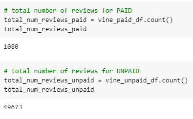
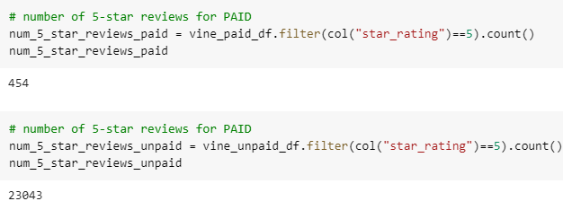
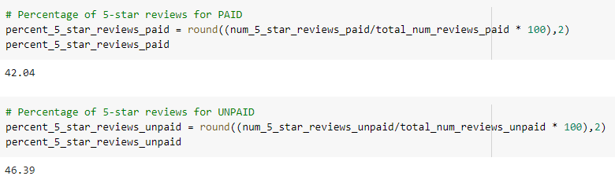

# Amazon Vine Analysis

## Background:
Amazon Vine Program is a service that allows manufacturers and publishers to receive reviews for their products. 
I picked electronics products from their 50 datasets and used PySpark to perform the ETL process to extract the dataset, transform the data,
connect to an AWS RDS instance, and load the transformed data into pgAdmin. 

### Technologies Used:
  - Amazon Reviews Data
  - PySpark
  - Google Colab
  - Amazon AWS
    - S3
    - RDS with PostgreSQL
  - pgAdmin

## Purpose of this analysis:
Analyze/compare Amazon reviews written by members of the paid Amazon Vine Program versus members who are not part of the Vine Program

## Results:
- Total number of reviews 

- Number of 5-star reviews

- Percentages of 4-star reviews

## Summary
#### Vine reviews of the dataset for "electronics" category on Amazon

Since the percentage of 5-star reviews for Paid vines is lower (42.%) than unpaid (46%), it doesn't look like there is a bias on the Vine program reviews.
We may be able to use t-test to see if there is a difference in mean distribution of the ratings. 
