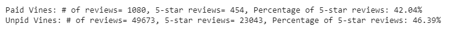

# Amazon Vine Analysis

## Background:
Amazon Vine Program is a service that allows manufacturers and publishers to receive reviews for their products. 
I picked electronics products from the 50 datasets and used PySpark to perform the ETL process to extract the dataset, transform the data,
connect to an AWS RDS instance, and load the transformed data into pgAdmin. 

### Technologies Used:
  - Amazon Reviews Data
  - PySpark
  - Google Colab
  - Amazon AWS
    - S3
    - RDS with PostgreSQL
  - pgAdmin

## Purpose of this analysis:

